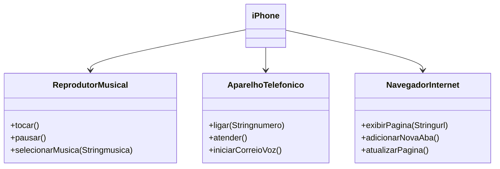

# Modelagem e Diagramação de um Componente iPhone.

Projeto baseado no vídeo de lançamento do iPhone de 2007, utilizando a ferramenta LucidChart.

O objetivo deste projeto é implementar as principais funções do iPhone, conforme representadas no vídeo de lançamento. As funcionalidades como reprodutor de música, aparelho telefônico e navegador de internet, todas presentes no iPhone que são representadas em um único dispositivo, utilizando o conceito de polimorfismo.

[Link do Video](https://www.youtube.com/watch?v=9ou608QQRq8)

### Diagrama UML

